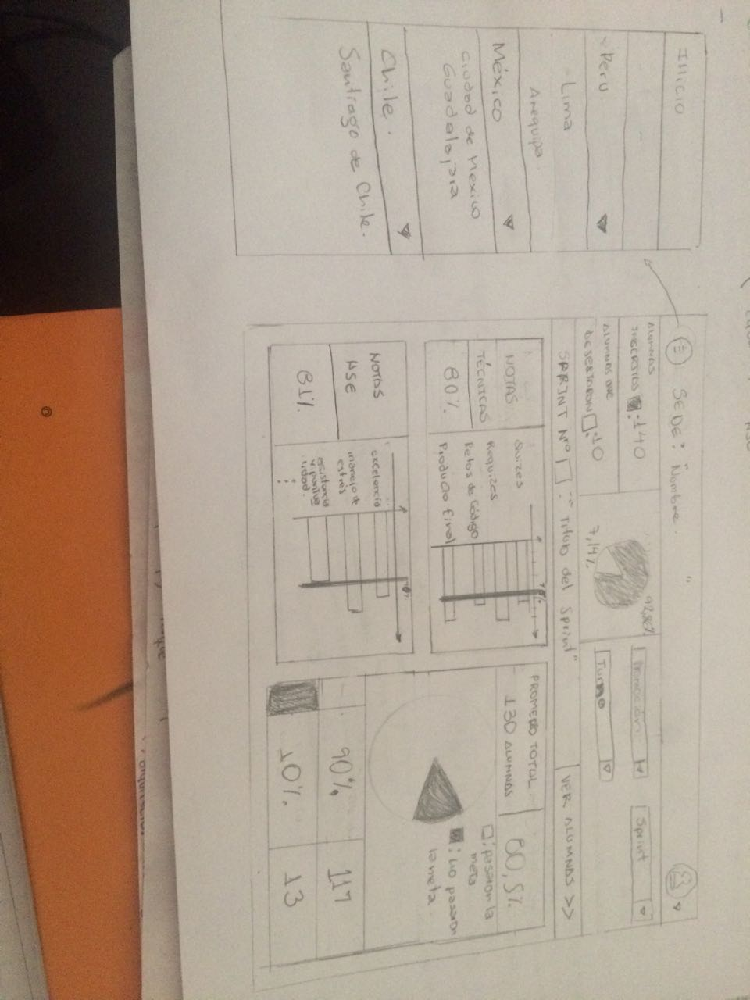
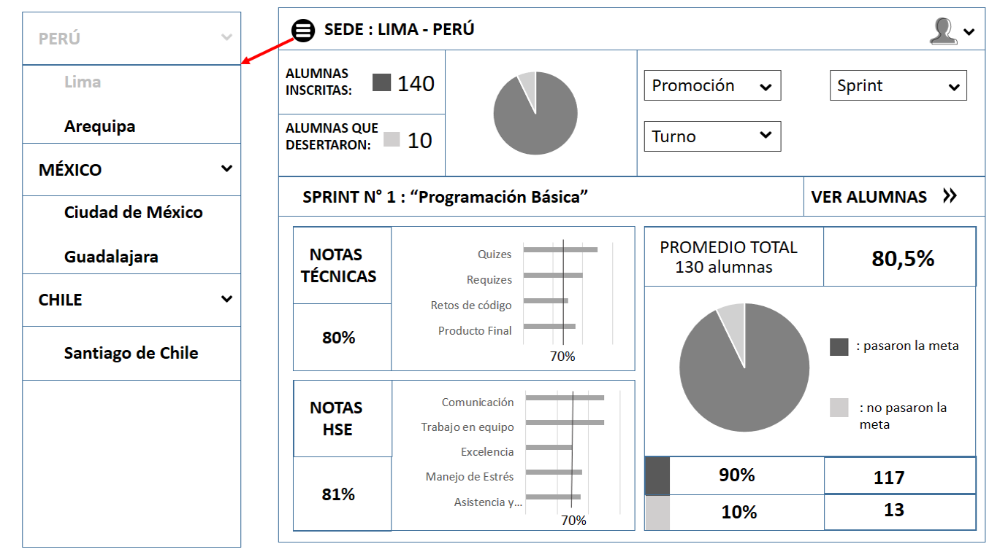

# RETO N° 3 : "Crea un sketch para la herramienta del dashboard de Laboratoria"
## Especificaciones del reto :
El dashboard es una herramienta utilizada por profesores, training managers, directores y gerentes de Laboratoria para ver rápidamente qué está pasando en el salón de clases de Laboratoria. En el dashboard, los usuarios mencionados pueden ver rápidamente estadísticas y datos en tiempo real como:
 * Número de alumnas inscritas
 * Número  de alumnas que desertaron
 * Número y % de alumnas que pasan el criterio mínimo      de     evaluación
 * Promedio de notas por sprint
 * Promedio de notas HSE
 * Promedio de notas técnicas

Además, dado que Laboratoria tiene muchas generaciones, regularmente 2 generaciones por año (estas generaciones empezaron en el 2014), y que opera en 4 sedes (Arequipa, Ciudad de México, Lima y Santiago de Chile), es posible que los usuarios quieran ver datos de sedes / generaciones anteriores para poder hacer comparaciones.

***
## DESARROLLO DEL RETO :

Siguiendo el gráfico de doble diamante ,  se realizo el sketch siguiendo las siguientes etapas :

 ### DESCUBRIMIENTO : "Salimos a entender quienes son nuestros usuarios y cuales son sus necesidades"
Busqué colaboradoras (Alejandra Ramirez(CEO de Laboratoria) y Ruth Salvador(Junior Teacher) ) a las cuales entrevisté por un espacio no mayor de 20 minutos; en esa entrevista mis colaboradoras me comunicaron sus necesidades y cuales fueron sus experiencias anteriores utilizando herramientas que les muestren el desempeño de las alumnas , de dicha entrevista pude obtener la siguiente data :
 * Las herramietas usadas anteriormente estaban enfocadas a mostrar datos estadisticos a las alumnas y no tanto a las training manager.
 * Una necesidad básica es mostrar los datos de forma visual(gráficos estadisticos),respetando una gama de colores.
 * Es importante ver puntajes ;cuantas chicas lograron la meta y cuantas están por debajo de la meta (numero y porcentaje)
 * Preferencias de navegación : menú hamburguesa y filtros para escoger la promocion, el turno y el sprint.
 * Visualizacion por sprint.
 * Mientras más especifico sean los datos, sirve más.
 * Para datos acumulados sirve ver el progreso de los sprints(lineas que cambien en el tiempo) y la comparacion de turnos.
 * Los tipos de graficos estadisticos dependeran de la data.
 * Que la estructura que fácil de entender.

 ### DEFINICIÓN: "De todo lo que descubrimos priorizamos que problemas queremos resolver"

 Para esta etapa  , ademas de tomar las consideraciones del reto ,he priorizado  solucionar el problema de mostrar datos estadisticos que sean simples de entender (con números y porcentajes) , tomando en cuenta las preferencias de navegacion de mis colaboradoras, ademas de la simplicidad y la sobriedad del diseño que se busca .

  ### PROTOTIPADO: "Diseñamos posibles soluciones"
  #### Boceto a lápiz:

  

  #### Boceto en computadora:

  
***
## Agradecimientos Especiales :
 Hago un agradecimiento especial a las personas a las que entrevisté para llegar a este resultado :
  * Alejandra Ramirez
  * Ruth Salvador
***
## Fuentes de información:
  * User Experience (https://youtu.be/SBIvPTSy1QM)
  * Diseño de dashboard(https://medium.com/@ecosenza/dashboard-content-design-methodology-task-map-9042b2339cfa)
  * LMS Laboratoria
